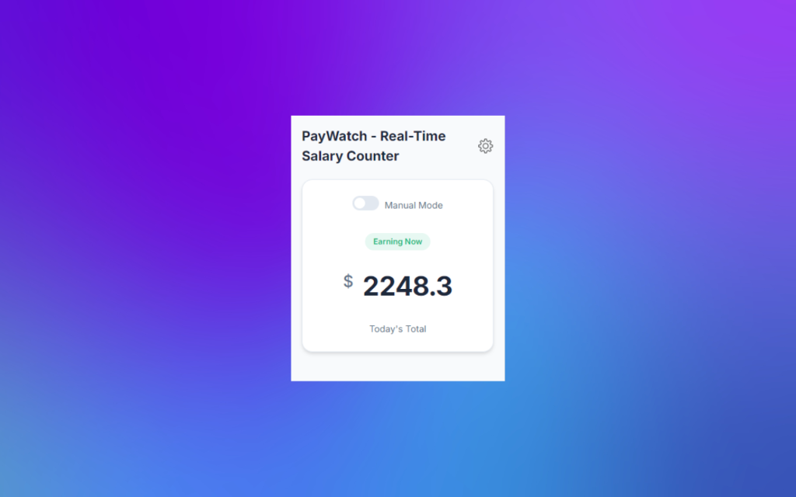
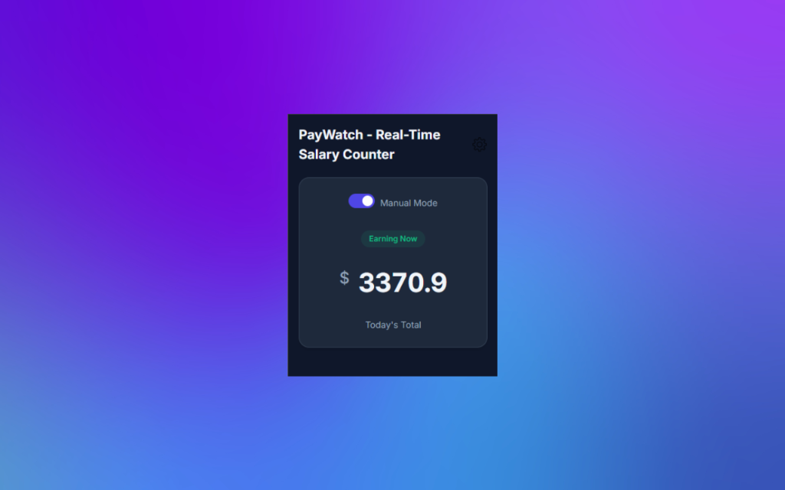
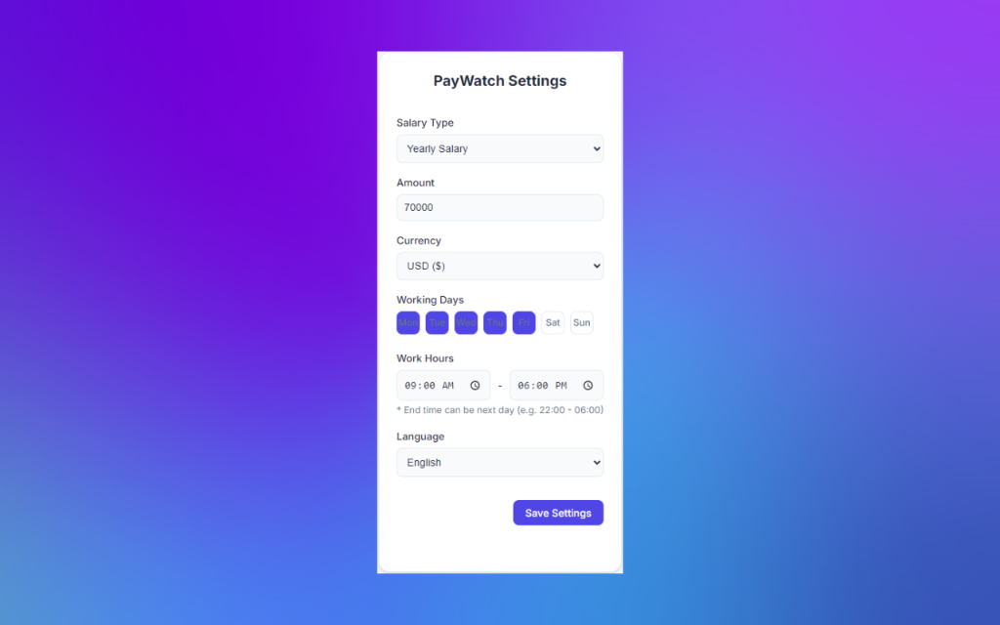

# PayWatch - Real-Time Salary Counter

> Watch your salary grow in real-time! ⏱️💰

PayWatch is a Chrome extension that displays how much money you're earning every second while you work. Perfect for staying motivated and understanding your salary in real-time.

## ✨ Features

- **Real-time calculation**: See your earnings increment every second
- **Flexible salary input**: Support for both yearly and monthly salary
- **Customizable work schedule**: 
  - Choose your work days (Mon-Sun)
  - Set your work hours
  - Overnight shift support (e.g., 22:00 - 06:00)
- **Manual mode**: Toggle to track overtime or irregular hours
- **Multi-currency**: USD, KRW, EUR, JPY, CNY
- **Multi-language**: English, Korean (한국어), Japanese (日本語)
- **Clean interface**: Modern, minimal design
- **Auto dark mode**: Automatically matches your system theme

## 📸 Screenshots

<table>
  <tr>
    <td></td>
    <td></td>
  </tr>
  <tr>
    <td align="center"><b>Light Mode</b></td>
    <td align="center"><b>Dark Mode</b></td>
  </tr>
  <tr>
    <td colspan="2"></td>
  </tr>
  <tr>
    <td colspan="2" align="center"><b>Settings Page</b></td>
  </tr>
</table>

## 🚀 Installation

### From Chrome Web Store
1. Visit the [PayWatch Chrome Web Store page](https://chromewebstore.google.com/detail/paywatch-real-time-salary/afeoioicnlnkkflpinekfilkglbmjcpe?hl=ko)
2. Click "Add to Chrome"
3. Click "Add extension" in the popup

### Manual Installation (For Development)
1. Download or clone this repository
2. Open Chrome and go to `chrome://extensions/`
3. Enable "Developer mode" (top right)
4. Click "Load unpacked"
5. Select the PayWatch folder

## 🎯 How to Use

1. **Click the PayWatch icon** in your Chrome toolbar
2. **Click the settings icon** (⚙️) to configure:
   - Your salary amount
   - Salary type (yearly or monthly)
   - Currency
   - Work schedule (days and hours)
   - Language preference
3. **Watch your earnings grow** in real-time!
4. **Use Manual Mode** to override automatic work hour detection

## 🔒 Privacy

PayWatch is completely private:
- ✅ No data collection
- ✅ No external connections
- ✅ All data stored locally on your device
- ✅ No tracking or analytics

## 🛠️ Technical Details

- **Framework**: Vanilla JavaScript
- **Manifest**: Version 3
- **Permissions**: Storage only (for saving your settings)
- **Storage**: Chrome Sync Storage API

## 📝 License

This project is open source and available under the MIT License.

## 🤝 Contributing

Contributions, issues, and feature requests are welcome!

## 💡 Support

If you encounter any issues or have suggestions, please open an issue on [GitHub](https://github.com/SeongJun15/PayWatch/issues).

---

**Made with ❤️ for workers everywhere**
